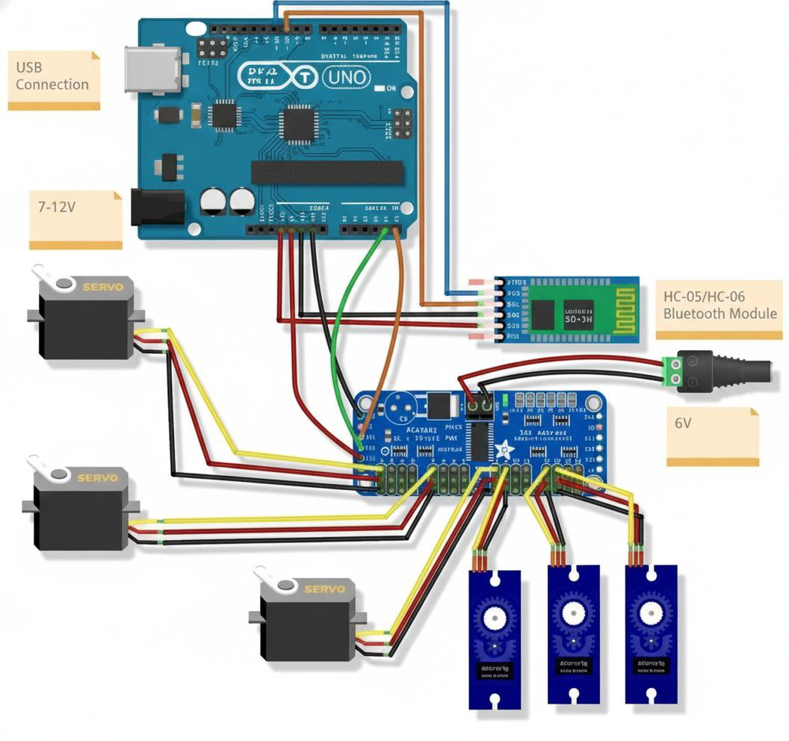

# FlexiArm:  A 6-DOF App-Controlled Industrial Manipulator

<p align="center">
  
</p>

[](https://www.arduino.cc/)
[](https://appinventor.mit.edu/)
[](https://www.bluetooth.com/)


A 6 Degrees of Freedom robotic arm designed for wireless operation via a smartphone application using Bluetooth connectivity.  This project integrates electronics, mechanical design, and software development to create a versatile robotic system capable of performing complex tasks such as picking, placing, and manipulating objects in a 3D workspace.

> **Course:** ETE 320 - Microprocessor and Microcontroller Sessional  
> **Department:** Electronics and Telecommunication Engineering, CUET

---

## 📋 Table of Contents

- [Features](#-features)
- [System Architecture](#-system-architecture)
- [Hardware Components](#-hardware-components)
- [Wiring Diagram](#-wiring-diagram)
- [Software Requirements](#-software-requirements)
- [Mobile App](#-mobile-app)
- [Bluetooth Commands](#-bluetooth-commands)
- [Usage](#-usage)
- [Calibration](#-calibration)
- [Troubleshooting](#-troubleshooting)
- [Team](#-team)
- [License](#-license)
- [Acknowledgments](#-acknowledgments)

---

## ✨ Features

| Feature | Description |
|---------|-------------|
| **6-DOF Precision Movement** | Six independent joints (gripper, wrist roll, wrist pitch, elbow, shoulder, base) enable complex, human-like maneuvers in 3D space |
| **Bluetooth Wireless Control** | Remote operation via HC-05/HC-06 module (10-20m range) eliminates physical tethers |
| **Intuitive Smartphone Interface** | User-friendly MIT App Inventor app with sliders (0-180°) and control buttons |
| **Pose Saving & Playback** | Stores up to 10 poses with optional looping for automated sequences |
| **Smooth & Safe Motion** | Incremental servo adjustments (1° steps, 10ms delays) ensure jerk-free movements |
| **Robust Power Management** | Separate power sources for Arduino and servos handle high-current demands |
| **Modular & Scalable Design** | PCA9685 servo driver supports up to 16 servos for future expansion |

---

## 🏗 System Architecture

```
┌─────────────────┐     Bluetooth      ┌─────────────────┐
│   Smartphone    │ ◄────────────────► │    HC-05/06     │
│  (FlexiArm App) │                    │     Module      │
└─────────────────┘                    └────────┬────────┘
                                                │ Serial (RX/TX)
                                                ▼
                                       ┌─────────────────┐
                                       │   Arduino UNO   │
                                       │   (Controller)  │
                                       └────────┬────────┘
                                                │ I2C (SDA/SCL)
                                                ▼
                                       ┌─────────────────┐
                                       │    PCA9685      │
                                       │  Servo Driver   │
                                       └────────┬────────┘
                                                │ PWM Signals
                    ┌───────┬───────┬───────┬───────┬───────┼───────┐
                    ▼       ▼       ▼       ▼       ▼       ▼       
                 Servo 1  Servo 2  Servo 3  Servo 4  Servo 5  Servo 6
                (Gripper) (Wrist  (Wrist  (Elbow) (Shoulder)(Base)
                          Roll)   Pitch)
```

---

## 🔧 Hardware Components

### Bill of Materials

| Component | Quantity | Specification | Purpose |
|-----------|----------|---------------|---------|
| Arduino UNO | 1 | ATmega328P | Main microcontroller |
| PCA9685 | 1 | 16-Channel, 12-bit PWM | Servo driver module |
| HC-05/HC-06 | 1 | Bluetooth 2.0 | Wireless communication |
| MG996R Servo | 3 | High torque (10 kg·cm) | Base, shoulder, elbow joints |
| SG90 Servo | 3 | Micro servo (1.8 kg·cm) | Wrist and gripper |
| Power Supply | 1 | 5V/6V, 10A | External servo power |
| Power Supply | 1 | 7-12V | Arduino power |
| Jumper Wires | - | Male-to-Male, Male-to-Female | Connections |
| 3D Printed Parts | - | PLA/ABS | Robot arm structure |

---

## 📐 Wiring Diagram

<p align="center">
  
</p>

### Connection Details

#### PCA9685 to Arduino UNO
| PCA9685 Pin | Arduino Pin |
|-------------|-------------|
| VCC | 5V |
| GND | GND |
| SDA | A4 |
| SCL | A5 |

#### HC-05/HC-06 to Arduino UNO
| Bluetooth Pin | Arduino Pin |
|---------------|-------------|
| VCC | 5V |
| GND | GND |
| TXD | Pin 10 (RX) |
| RXD | Pin 11 (TX) |

#### Servo Connections (PCA9685)
| Servo | Channel | Joint | Marker |
|-------|---------|-------|--------|
| Servo 1 | CH0 | Gripper | ① |
| Servo 2 | CH1 | Wrist Roll | ② |
| Servo 3 | CH2 | Wrist Pitch | ③ |
| Servo 4 | CH3 | Elbow | ④ |
| Servo 5 | CH4 | Shoulder | ⑤ |
| Servo 6 | CH5 | Base Rotation | ⑥ |

> ⚠️ **Important:** Connect external 5V/6V power supply to PCA9685's V+ terminal for servo power.  Do NOT power servos from Arduino's 5V pin. 

---

## 💻 Software Requirements

### Arduino Libraries
- [Adafruit PWM Servo Driver Library](https://github.com/adafruit/Adafruit-PWM-Servo-Driver-Library)
- [Wire Library](https://www.arduino.cc/en/Reference/Wire) (Built-in)
- [SoftwareSerial Library](https://www.arduino.cc/en/Reference/SoftwareSerial) (Built-in)

### Development Tools
- [Arduino IDE](https://www.arduino.cc/en/software) (v1.8.x or v2.x)
- [MIT App Inventor](https://appinventor.mit.edu/) (for mobile app customization)

---

## 📲 Mobile App

The **FlexiArm** controller app is built using **MIT App Inventor** and provides an intuitive interface for controlling all 6 joints of the robotic arm wirelessly. 

### App Screenshots

<p align="center">
  
  &nbsp;&nbsp;&nbsp;
</p>

### App Interface Guide

| Element | Description |
|---------|-------------|
| **Select Device** | Tap to choose your paired HC-05/HC-06 Bluetooth module |
| **Connection Status** | Shows "Connected" or "Disconnected" state |
| **Sliders 1-6** | Control each servo joint (0-180° range) |
| **Robot Image** | Visual reference with numbered joint markers (①-⑥) |
| **LOOP Toggle** | Enable/disable continuous pose playback |
| **Pose Count** | Displays number of saved poses (max 10) |
| **SAVE** | Store current arm position as a pose |
| **Play** | Execute all saved poses in sequence |
| **Reset** | Delete all saved poses |
| **Stop** | Halt pose playback immediately |
| **About** | App information and credits |

### Joint Mapping (App Sliders)

| Slider | Joint | Movement |
|--------|-------|----------|
| **1** | Gripper | Open/Close |
| **2** | Wrist Roll | Rotate wrist |
| **3** | Wrist Pitch | Tilt wrist up/down |
| **4** | Elbow | Bend elbow |
| **5** | Shoulder | Raise/lower arm |
| **6** | Base | Rotate entire arm |

### Building the App (Optional)
If you want to customize the app:
1. Open [MIT App Inventor](https://appinventor.mit.edu/)
2. Import the `FlexiArm.aia` project file from `app/source/`
3. Modify the design or blocks as needed
4. Build APK via **Build** → **App (provide QR code for . apk)**

---

## 📡 Bluetooth Commands

The app communicates with Arduino using these serial commands:

| Command | Description | Example |
|---------|-------------|---------|
| `X,Y` | Move servo X to position Y (0-180°) | `1,90` → Gripper to 90° |
| `S` | Save current pose | - |
| `P` | Play saved poses | - |
| `St` | Stop playback | - |
| `R` | Reset/delete all poses | - |
| `LoopON` | Enable loop playback | - |
| `LoopOFF` | Disable loop playback | - |

### Command Examples
```
1,90     → Move Gripper to 90° (half open)
6,180    → Rotate Base to 180°
S        → Save current position as pose
P        → Play all saved poses
LoopON   → Enable continuous loop
St       → Stop playback
R        → Clear all saved poses
```

---

## 🎮 Usage

### Quick Start Guide

1. **Power On**
   - Connect 7-12V power to Arduino
   - Connect 5-6V external power to PCA9685 servo rail
   - Arm will move to initial position automatically

2. **Connect via Bluetooth**
   - Open FlexiArm app on your phone
   - Tap "Select Device"
   - Choose your HC-05/HC-06 from the list
   - Wait for "Connected" status

3. **Control the Arm**
   - Move sliders to control individual joints in real-time
   - The arm responds smoothly to slider changes

4. **Record & Playback Sequences**
   - Position the arm using sliders
   - Tap **SAVE** to store the pose
   - Repeat to save up to 10 poses
   - Tap **Play** to execute the sequence
   - Enable **LOOP** for continuous repetition
   - Tap **Stop** to halt at any time

5. **Reset**
   - Tap **Reset** to clear all saved poses and start fresh

---

## 🔧 Calibration

### Servo PWM Calibration
The default PWM range is 150-700 (mapped from 0-180°). Adjust in code if your servos require different values:

```cpp
// In processLastValue() function
int targetPwmValue = map(targetPos, 0, 180, 150, 700);
```

### Initial Positions
Modify default startup positions in the code: 
```cpp
int currentServoPositions[numServos] = {525, 375, 375, 375, 375, 390};
```

### Motion Smoothness
Adjust these values for smoother or faster movement:
```cpp
const int stepDelay = 10;  // Delay between steps (ms) - increase for smoother
const int stepSize = 1;    // PWM increment per step - decrease for smoother
```

---

## 🐛 Troubleshooting

| Issue | Possible Cause | Solution |
|-------|----------------|----------|
| Servos not moving | No external power | Connect 5-6V supply to PCA9685 V+ terminal |
| Bluetooth won't connect | Module not paired | Pair HC-05/HC-06 in phone settings first (PIN: 1234) |
| App shows "Disconnected" | Wrong device selected | Ensure correct Bluetooth device is selected |
| Jerky servo movement | Step size too large | Decrease `stepSize` or increase `stepDelay` |
| Limited range of motion | PWM values incorrect | Adjust min/max in `map()` function (150-700) |
| "Memory full" message | 10 poses already saved | Use Reset (R) command to clear poses |
| Servos jitter at startup | Initial values wrong | Calibrate `currentServoPositions` array |
| App crashes on connect | Bluetooth permissions | Grant location & Bluetooth permissions to app |

---

## 👥 Team

<p align="center">
  <b>Department of Electronics and Telecommunication Engineering</b><br>
  <b>Chittagong University of Engineering and Technology (CUET)</b>
</p>

<table align="center">
  <tr>
    <th>Name</th>
    <th>Student ID</th>
  </tr>
  <tr>
    <td>Mueez Mejbah</td>
    <td>2108010</td>
  </tr>
  <tr>
    <td>Belayet Hossain Saimun</td>
    <td>2108032</td>
  </tr>
  <tr>
    <td>Sammaul Islam Siam</td>
    <td>2108040</td>
  </tr>
  <tr>
    <td>Mohammad Mesbahul Alam</td>
    <td>2108043</td>
  </tr>
  <tr>
    <td>Saklain Shuvo</td>
    <td>2108044</td>
  </tr>
  <tr>
    <td>Md. Hasibul Islam Jihad</td>
    <td>2108048</td>
  </tr>
</table>

---

## 📄 License

This project is licensed under the MIT License - see the [LICENSE](LICENSE) file for details.

---

## 🙏 Acknowledgments

- **Course Instructor:** Md. Farhad Hossain, Assistant Professor, Department of ETE, CUET
<!--
- **Reference:** [OmArTronics DIY 6-DOF Robotic Arm Tutorial](https://omartronics.com/diy-6-dof-robotic-arm-with-bluetooth-control-design-build-and-program/)
-->
- **Libraries:** Adafruit Industries for the PWM Servo Driver Library
- **Tools:** MIT App Inventor for mobile app development

---

<p align="center">
  <b>Made with ❤️ for ETE 320 - Microprocessor and Microcontroller Sessional</b>
</p>

<p align="center">
  
</p>
